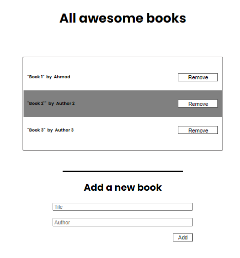

# Awesome books: plain JavaScript with objects

## Learning objectives

- Understand different ways to create objects in JavaScript.
- Create and access properties and methods of JavaScript objects.

### Instructions

- Deploy your website using GitHub Pages.
- Check the online version of your portfolio and make sure that the page works properly.
- Update the README of your repository to include a link to the online version.

=======

## Built With

- HTML/SCSS
- Node.JS
- Figma

=======

## Getting Started

If you want to visit the deployed app just visit the following link:

- [`https://metsanpeitto.github.io/Awesome_books-m2_w1/`](https://metsanpeitto.github.io/Awesome_books-m2_w1/)

If you want a copy of this file go to the github repository and download it

- `git clone https://github.com/Metsanpeitto/Awesome_books-m2_w1`

After cloning it you can see the project opening the index.html file with your favorite browser ( Firefox for example )

### Project requirements

- Implement only a basic UI with plain HTML:

  

- Create a collection that keeps a list of books (hint: you can use an array of objects for that).
- Create a function to add a new book to the collection, with title and author.
- Create a function to remove a book from the collection (hint: you can use the [array filter()](https://developer.mozilla.org/en-US/docs/Web/JavaScript/Reference/Global_Objects/Array/filter) method).
- Display all books saved in the collection in the top part of the page.
- Make sure that when a user clicks the "Add" button:
  - A new book is added to the collection.
  - The new book is displayed in the page.
- Make sure that when a user clicks the "Remove" button:
  - The correct book is removed from the collection.
  - The correct book dissapears from the page.
- Make sure that data is preserved in the browser's memory by using [localStorage](https://github.com/microverseinc/curriculum-html-css/blob/main/local_storage.md).
- To debug your application, you can use [console.log()](https://developer.mozilla.org/en-US/docs/Web/API/Console/log). **Remember to remove debugging code before pushing your code to the remote repository.**
- Don't use any library or framework, use only plain JavaScript.
-  **You need to use pair-programming for this project. We will check to see if both partners submitted code by looking at the commit history for each project. Therefore you need to use only one repository for your pair-programming group.**

### Prerequisites

- Node.JS

=======

## Author

👤 **Abraham Rodriguez**

- GitHub: [@metsanpeitto](https://github.com/Metsanpeitto)
- Twitter: [@metsanpeitto](https://twitter.com/home)
- LinkedIn: [Abraham Rodriguez](https://www.linkedin.com/in/abraham-rodriguez-3283a319a/)
- Portfolio: [Waldenberg](https://portfolio.waldenberginc.com)

👤 **Ahmad Zia Yousufi**

- GitHub: [@ahzia](https://github.com/ahzia)
- Twitter: [@ZiaYousofi](https://twitter.com/ZiaYousofi)
- LinkedIn: [Ahmad zia Yousufi](https://https://www.linkedin.com/in/ah-ziayosfi)

=======

## 🤝 Contributing

Contributions, issues, and feature requests are welcome!

Feel free to check the [issues page](../../issues/).

=======

## Show your support

Give a ⭐️ if you like this project!

=======

## Acknowledgments

- Microverse for giving me this chance
- The amazing code reviewers for making me improve every day :thumbsup:

=======
